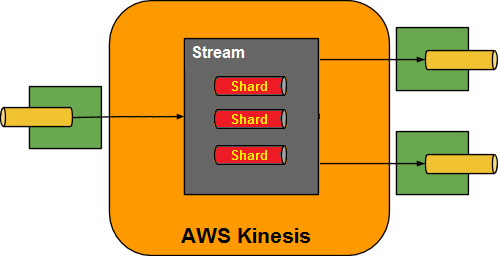

[partintro]
--
This guide describes the https://aws.amazon.com/kinesis/[AWS Kinesis] implementation of the Spring Cloud Stream Binder.
It contains information about its design, usage and configuration options, as well as information on how the Stream Cloud Stream concepts map into AWS Kinesis specific constructs.
--

== Usage

For using the AWS Kinesis Binder, you just need to add it to your Spring Cloud Stream application, using the following Maven coordinates:

[source,xml]
----
<dependency>
  <groupId>org.springframework.cloud</groupId>
  <artifactId>spring-cloud-stream-binder-kinesis</artifactId>
</dependency>
----

== Kinesis Binder Overview

The Spring Cloud Stream Binder for AWS Kinesis provides the binding implementation for the Spring Cloud Stream.
This implementation uses Spring Integration AWS Kinesis Channel Adapters at its foundation.
The following captures how the Kinesis Binder implementation maps each of the configured destination to a AWS Kinesis Streams:

.Kinesis Binder

Unlike https://kafka.apache.org/[Apache Kafka] the AWS Kinesis doesn't provide out-of-the-box support for consumer groups.
The support of this feature is implemented as a part of `MetadataStore` key for shard checkpoints in the `KinesisMessageDrivenChannelAdapter` - `[CONSUMER_GROUP]:[STREAM]:[SHARD_ID]`.
In addition the `LockRegistry` is used to ensure exclusive access to each shard.
This way only one channel adapter in the same consumer group will consumer messages from a single shard in the stream it is configured for.

The partitioning logic in AWS Kinesis is similar to the Apache Kafka support, but with slightly different logic.
The `partitionKey` on the producer side determines which shard in the stream the data record is assigned to.
Partition keys are Unicode strings with a maximum length limit of 256 characters for each key.
AWS Kinesis uses the partition key as input to a hash function that maps the partition key and associated data to a specific shard.
Specifically, an MD5 hash function is used to map partition keys to 128-bit integer values and to map associated data records to shards.
As a result of this hashing mechanism, all data records with the same partition key map to the same shard within the stream.
But at the same time we can't select target shard to send explicitly.
Although calculating the hash manually (and use `explicitHashKeyExpression` for producer, respectively), we may track the target shard by inclusion into its `HashKeyRange`.

By default partition key is a result of the `Object.hash()` from the message `payload`.

The Spring Cloud Stream partition handling logic is excluded in case of AWS Kinesis Binder since it is out of use and the provided `producer.partitionKeyExpression` is propagated to the `KinesisMessageHandler` directly.

On the consumer side the `instanceCount` and `instanceIndex` are used to distribute shards between consumers in group evenly.
This has an effect only for regular `KinesisMessageDrivenChannelAdapter` which can assign specific shards for the target Kinesis consumer.
With Kinesis Client Library we can only subscriber to the provided stream and shards distribution is done by that client.
See more information in the Kinesis Client Library https://docs.aws.amazon.com/streams/latest/dev/developing-consumers-with-kcl.html[documentation].

== Consumer Groups
Consumer groups are implemented with focus on High availability, Message ordering and guaranteed Message delivery in Spring cloud stream.
A `single consumer` for the message is ensured by https://docs.spring.io/spring-cloud-stream/docs/Elmhurst.RELEASE/reference/htmlsingle/#consumer-groups[consumer group abstraction].

To have a highly available consumer group for your kinesis stream:

 - Ensure all instances of your consumer applications use a shared `DynamoDbMetadataStore` and `DynamoDbLockRegistry` (See below for configuration options).
 - Use same group name for the channel in all application instances by using property `spring.cloud.stream.bindings.<bindingTarget>.group`.

These configurations alone guarantee HA, message ordering and guaranteed message delivery.
However, even distribution across instances is not guaranteed as of now.
There is a very high chance that a single instance in a consumer group will pick up all the shards for consuming.
But, when that instance goes down (couldn't send heartbeat for any reason), other instance in the consumer group will start processing from the last checkpoint of the previous consumer (for shardIterator type TRIM_HORIZON).

So, configuring consumer concurrency is important to achieve throughput.
It can be configured using `spring.cloud.stream.bindings.<bindingTarget>.consumer.concurrency`.

=== Static shard distribution within a single consumer group
It is possible to evenly distribute shard across all instances within a single consumer group.
This done by configuring:

 - `spring.cloud.stream.instanceCount=` to number of instances
 - `spring.cloud.stream.instanceIndex=` current instance's index

The only way to achieve HA in this case is that, when an instance processing a particular shard goes down, another instance must have `spring.cloud.stream.instanceIndex=` to be the same as the failed instance's index to start processing from those shards.

== Configuration Options

This section contains settings specific to the Kinesis Binder and bound channels.

For general binding configuration options and properties, please refer to the https://docs.spring.io/spring-cloud-stream/docs/current/reference/htmlsingle/#_configuration_options[Spring Cloud Stream core documentation].

[[kinesis-binder-properties]]
=== Kinesis Binder Properties

The following properties are available for Kinesis Binder configuration, which start with the `spring.cloud.stream.kinesis.binder.` prefix

headers::
  The set of custom headers to transfer over AWS Kinesis
+
Default: "correlationId", "sequenceSize", "sequenceNumber", "contentType", "originalContentType".
describeStreamBackoff::
  The amount of time in milliseconds in between retries for the `DescribeStream` operation
+
Default: `1000`.
describeStreamRetries::
  The amount of times the consumer will retry a `DescribeStream` operation waiting for the stream to be in `ACTIVE` state
+
Default: `50`.
autoCreateStream::
    If set to `true`, the binder will create the stream automatically.
If set to `false`, the binder will rely on the stream being already created.
+
Default: `true`
autoAddShards::
    If set to `true`, the binder will create new shards automatically.
If set to `false`, the binder will rely on the shard size of the stream being already configured.
If the shard count of the target stream is smaller than the expected value, the binder will ignore that value
+
Default: `false`
minShardCount::
    Effective only if `autoAddShards` is set to `true`.
The minimum number of shards that the binder will configure on the stream from which it produces/consumes data.
It can be superseded by the `partitionCount` setting of the producer or by the value of `instanceCount * concurrency` settings of the producer (if either is larger)
+
Default: `1`
kplKclEnabled::
    Enable the usage of https://docs.aws.amazon.com/streams/latest/dev/developing-consumers-with-kcl.html[Kinesis Client Library] / https://docs.aws.amazon.com/streams/latest/dev/developing-producers-with-kpl.html[Kinesis Producer Library] for all message consumption and production
+
Default: `false`

=== MetadataStore
Support for consumer groups is implemented using https://github.com/spring-projects/spring-integration-aws#metadata-store-for-amazon-dynamodb[DynamoDbMetadataStore].
The `partitionKey` name used in the table is `KEY`.
This is not configurable.

DynamoDB Checkpoint properties are prefixed with `spring.cloud.stream.kinesis.binder.checkpoint.`

table::
	The name to give the DynamoDb table
+
Default: `SpringIntegrationMetadataStore`
createDelay::
    The amount of time in seconds between each polling attempt while waiting for the checkpoint DynamoDB table to be created
+
Default: `1`
createRetries::
    The amount of times the consumer will poll DynamoDB while waiting for the checkpoint table to be created
+
Default: `25`
billingMode::
    The Billing Mode of the DynamoDB table. See https://docs.aws.amazon.com/amazondynamodb/latest/developerguide/HowItWorks.ReadWriteCapacityMode.html#HowItWorks.OnDemand[DynamoDB On-Demand Mode]. Possible values are `provisioned` and `payPerRequest`. If left empty or set to `payPerRequest` both `readCapacity` and `writeCapacity` are ignored
+
Default: `payPerRequest`
readCapacity::
	The Read capacity of the DynamoDb table.
See https://docs.aws.amazon.com/amazondynamodb/latest/developerguide/HowItWorks.ReadWriteCapacityMode.html#HowItWorks.ProvisionedThroughput.Manual[DynamoDB Provisioned Throughput]. This property is used only when `billingMode` is set to `provisioned`
+
Default: `1`
writeCapacity::
	The write capacity of the DynamoDb table.
See https://docs.aws.amazon.com/amazondynamodb/latest/developerguide/HowItWorks.ReadWriteCapacityMode.html#HowItWorks.ProvisionedThroughput.Manual[DynamoDB Provisioned Throughput]. This property is used only when `billingMode` is set to `provisioned`
+
Default: `1`
timeToLive::
	A period in seconds for items expiration.
See https://docs.aws.amazon.com/amazondynamodb/latest/developerguide/TTL.html[DynamoDB TTL]
+
No default - means no records expiration.

=== LockRegistry
LockRegistry is used to ensure exclusive access to each shard so that, only one channel adapter in the same consumer group will consumer messages from a single shard in the stream.
This is implemented using https://github.com/spring-projects/spring-integration-aws#lock-registry-for-amazon-dynamodb[DynamoDbLockRegistry]

DynamoDB `LockRegistry` properties are prefixed with `spring.cloud.stream.kinesis.binder.locks.`

table::
	The name to give the DynamoDB table
+
Default: `SpringIntegrationLockRegistry`
billingMode::
    The Billing Mode of the DynamoDB table. See https://docs.aws.amazon.com/amazondynamodb/latest/developerguide/HowItWorks.ReadWriteCapacityMode.html#HowItWorks.OnDemand[DynamoDB On-Demand Mode]. Possible values are `provisioned` and `payPerRequest`. If left empty or set to `payPerRequest` both `readCapacity` and `writeCapacity` are ignored
+
Default: `payPerRequest`
readCapacity::
	The Read capacity of the DynamoDB table.
See https://docs.aws.amazon.com/amazondynamodb/latest/developerguide/HowItWorks.ReadWriteCapacityMode.html#HowItWorks.ProvisionedThroughput.Manual[DynamoDB Provisioned Throughput]. This property is used only when `billingMode` is set to `provisioned`
+
Default: `1`
writeCapacity::
	The write capacity of the DynamoDb table.
See https://docs.aws.amazon.com/amazondynamodb/latest/developerguide/HowItWorks.ReadWriteCapacityMode.html#HowItWorks.ProvisionedThroughput.Manual[DynamoDB Provisioned Throughput]. This property is used only when `billingMode` is set to `provisioned`
+
Default: `1`
leaseDuration::
	The length of time that the lease for the lock will be granted for.
	 If this is set to, for example, 30 seconds, then the lock will expire if the heartbeat is not sent for at least 30 seconds (which would happen if the box or the heartbeat thread dies, for example.)
+
Default: `20`
heartbeatPeriod::
	How often to update DynamoDB to note that the instance is still running (recommendation is to make this at least 3 times smaller than the `leaseDuration` - for example `heartBeatPeriod=1` second, `leaseDuration=10` seconds could be a reasonable configuration, make sure to include a buffer for network latency.)
+
Default: `5`
refreshPeriod::
	How long to wait before trying to get the lock again (if set to 10 seconds, for example, it would attempt to do so every 10 seconds)
+
Default: `1000`
partitionKey::
	The partition key name of the table.
+
Default: `lockKey`
sortKeyName::
	The sort key name for DynamoDB table partitioning.
+
Default: `sortKey`
sortKey::
	The sort key to try and acquire the lock on (specify if and only if the table has sort keys)
+
Default: `SpringIntegrationLocks`

=== Kinesis Consumer Properties

The following properties are available for Kinesis consumers only and must be prefixed with `spring.cloud.stream.kinesis.bindings.<channel-name>.consumer`

startTimeout::
  The amount of time to wait for the consumer to start, in milliseconds.
+
Default: `60000`.
listenerMode::
  The mode in which records are processed.
  If `record`, each `Message` will contain `byte[]` from a single `Record.data`.
  If `batch`, each `Message` will contain a `List<byte[]>` extracted from the consumed records.
  When `useNativeDecoding = true` is used on the consumer together with the `listenerMode = batch`, there is no any out-of-the-box conversion happened and a result message contains a payload like `List<com.amazonaws.services.kinesis.model.Record>`.
  It's up to target application to convert those records manually.
+
Default: `record`
checkpointMode::
  The mode in which checkpoints are updated.
  If `record`, checkpoints occur after each record is processed (but this option is only effective if `listenerMode` is set to `record`). If `batch`, checkpoints occur after each batch of records is processed.
  If `manual`, checkpoints occur on demand via the `Checkpointer` callback.
  If `periodic`, checkpoints occurs at specified time interval (from `interval` property in checkpoint configuration)
+
Default: `batch`
checkpointInterval::
  The interval, in milliseconds, between two checkpoints when checkpoint mode is `periodic`.
+
Default - `5000`
workerId::
  The worker identifier used to distinguish different workers/processes (only used when Kinesis Client Library is enabled).
+
No default - if not set, default value inside spring-integration-aws will be used (random UUID).
recordsLimit::
  The maximum number of records to poll per `GetRecords` request.
  Must not be greater than `10000`.
+
Default: `10000`
idleBetweenPolls::
  The sleep interval used in the main loop between shards polling cycles, in milliseconds. Must not be less than `250`.
+
Default: `1000`
consumerBackoff::
  The amount of time the consumer will wait to attempt another `GetRecords` operation after a read with no results, in milliseconds.
+
Default: `1000`
shardIteratorType::
  The `com.amazonaws.services.kinesis.model.ShardIteratorType` name with an optional `sequenceNumber` for the `AT_SEQUENCE_NUMBER/AFTER_SEQUENCE_NUMBER` or milliseconds for the `AT_TIMESTAMP` after `:`.
  For example: `AT_TIMESTAMP:1515090166767`.
+
Default: `LATEST` for anonymous groups and `TRIM_HORIZON` otherwise.

NOTE: When `TRIM_HORIZON` shard iterator type is used, we need to take into account the time lag which happens during pointing the `ShardIterator` to the last untrimmed record in the shard in the system (the oldest data record in the shard).
So the `getRecords()` will move from that point to the last point, which takes time.
It is by default 1 day and it can be extended to 7 days.
This happens only for new consumer groups.
Any subsequent starts of the consumer in the same group are adjusted according the stored checkpoint via `AFTER_SEQUENCE_NUMBER` iterator type.

dynamoDbStreams::
  The `boolean` flag indicating that Kinesis consumer channel adapter should adapt DynamoDB Streams functionality instead of regular Kinesis streams.
The `spring.cloud.stream.bindings.<bindingTarget>.destination` value must be a DynamoDB table name.
Default: `false`.

Starting with version 2.0.1, beans of `KinesisClientLibConfiguration` type can be provided in the application context to have a full control over Kinesis Client Library configuration options.
The stream and consumer group (plus workerId) must be provided in the respective `KinesisClientLibConfiguration` bean.
When `KclMessageDrivenChannelAdapter` endpoint is configured in the binder, it selects an appropriate `KinesisClientLibConfiguration` from the application context according a destination (stream) for binding.
If there is no `KinesisClientLibConfiguration` bean for its stream, the `KclMessageDrivenChannelAdapter` falls back to original configuration with defaults options for its internal `KinesisClientLibConfiguration`.

shardId::
An explicit shard id to consume from.

NOTE: Kinesis Client Library does not support a configuration for a specific shard.
When `shardId` property is used, it is ignored for Kinesis Client Library and standard stream consumer distribution is applied.
Also, in case of an `instanceCount > 1`, application will throw validation exception.
The `instanceCount` and `shardId` are considered as mutually exclusive.

=== Kinesis Producer Properties

The following properties are available for Kinesis producers only and must be prefixed with `spring.cloud.stream.kinesis.bindings.<bindingTarget>.producer.`.

sync::
  Whether the producer should act in a synchronous manner with respect to writing records into a stream.
If true, the producer will wait for a response from Kinesis after a `PutRecord` operation.
+
Default: `false`
sendTimeout::
  Effective only if `sync` is set to `true`. The amount of time to wait for a response from Kinesis after a `PutRecord` operation, in milliseconds.
+
Default: `10000`

Also, if you'd like to produce a batch of records into Kinesis stream, the message payload must be as a `PutRecordsRequest` instance and general Spring Cloud Stream producer property `useNativeEncoding` must be set to `true`, so Spring Cloud Stream won't try to convert a `PutRecordsRequest` into a `byte[]`. The content of the `PutRecordsRequest` is now end-user responsibility.
[[kinesis-error-channels]]
== Error Channels

The binder can be configured to send producer exceptions to an error channel.
See https://docs.spring.io/spring-cloud-stream/docs/current/reference/htmlsingle/#_spring_integration_error_channel_support[the section on Spring Cloud error channel support] for more information.

The payload of the `ErrorMessage` for a send failure is an `AwsRequestFailureException` with properties:

* `failedMessage` - the spring-messaging `Message<?>` that failed to be sent.
* `request` - the raw `AmazonWebServiceRequest` (either `PutRecordRequest` or `PutRecordsRequest`) that was created from the `failedMessage`.

There is no automatic handling of these exceptions (such as sending to a dead letter queue), but you can consume these exceptions with your own Spring Integration flow.

[[dynamodb-streams]]
== DynamoDB Streams

Starting with version 1.2, the `KinesisMessageChannelBinder` supports DynamoDB Streams for Kinesis consumer channel adapter.
The functionality is based on the https://github.com/awslabs/dynamodb-streams-kinesis-adapter[DynamoDB Streams Kinesis Adapter] and every Kinesis consumer endpoint selects an appropriate Kinesis Client according the `spring.cloud.stream.kinesis.bindings.<bindingTarget>.consumer.dynamoDbStreams` boolean flag.
In this case a value for `spring.cloud.stream.bindings.<bindingTarget>.destination` must be a DynamoDB table name.

[[optional-resources]]
== Optional Resources

Starting with version 1.2, if your Spring Cloud Stream application delivered only in the `source` role, the extra beans, required for `sink` (or Kinesis consumers), are not going to be registered in the application context and, therefore, no need to worry about their resources on AWS.
The story is about DynamoDB and Cloud Watch.

[[aws-roles-and-policies]]
== AWS Roles and Policies

In order to be able to run properly on AWS, the role that will be used by the application needs to have a set of policies configured.
Here are the policies statements that your application role need:

[source,json]
----
{
    "Version": "2012-10-17",
    "Statement": [
        {
            "Effect": "Allow",
            "Action": [
                "kinesis:SubscribeToShard",
                "kinesis:DescribeStreamSummary",
                "kinesis:DescribeStreamConsumer",
                "kinesis:GetShardIterator",
                "kinesis:GetRecords",
                "kinesis:PutRecords",
                "kinesis:DescribeStream"
            ],
            "Resource": [
                "arn:aws:kinesis:<region>:<account_number>:*/*/consumer/*:*",
                "arn:aws:kinesis:<region>:<account_number>:stream/<stream_name>"
            ]
        },
        {
            "Effect": "Allow",
            "Action": "kinesis:DescribeLimits",
            "Resource": "*"
        },
        {
          "Sid": "DynamoDB",
          "Effect": "Allow",
          "Action": [
            "dynamodb:BatchGetItem",
            "dynamodb:BatchWriteItem",
            "dynamodb:PutItem",
            "dynamodb:GetItem",
            "dynamodb:Scan",
            "dynamodb:Query",
            "dynamodb:UpdateItem"
          ],
          "Resource": [
            "arn:aws:dynamodb:<region>:<account>:table/<name-of-metadata-table>",
            "arn:aws:dynamodb:<region>:<account>:table/<name-of-lock-table>"
          ]
        }
    ]
}
----

Keep in mind that these are only the policies to allow the application to consume/produce records from/to Kinesis.
If you're going to allow spring-cloud-stream-binder-kinesis to create the resources for you, you'll need an extra set of policies.
[source,json]
----
{
    "Version": "2012-10-17",
    "Statement": [
        {
            "Effect": "Allow",
            "Action": [
                "dynamodb:CreateTable",
                "kinesis:CreateStream",
                "kinesis:UpdateShardCount",
                "kinesis:EnableEnhancedMonitoring",
                "kinesis:DisableEnhancedMonitoring",
                "dynamodb:DeleteTable",
                "dynamodb:UpdateTable"
            ],
            "Resource": [
                "arn:aws:dynamodb:<region>:<account>:table/<table_name>",
                "arn:aws:kinesis:<region>:<account>:stream/<stream_name>"
            ]
        }
    ]
}
----

[[running-locally-with-localstack]]
== Running locally with localstack

Sometimes we don't have the necessary permissions to connect to the real Kinesis and DynamoDB from our developer's machine.
In moments like this, it's pretty useful to setup Localstack in your project, so you can run everything locally, without
having to worry about permissions and enterprise restrictions.

Create a *docker-compose.yaml* file, in the root of your project, to quickly start localstack

[source, yaml]
----
version: '3.5'

services:
  localstack:
    image: localstack/localstack:0.12.10
    environment:
      - AWS_DEFAULT_REGION=sa-east-1
      - EDGE_PORT=4566
      - SERVICES=kinesis, dynamodb
    ports:
      - '4566:4566'
    volumes:
      - localstack:/tmp/localstack
      - './setup-localstack.sh:/docker-entrypoint-initaws.d/setup-localstack.sh'

volumes:
  localstack:
----

After that, create a script called *setup-localstack.sh*, in the root directory, that will contain the script to create the
Kinesis Stream, and the 2 DynamoDB Tables

[source, shell script]
----
awslocal kinesis create-stream --stream-name my-test-stream --shard-count 1

awslocal dynamodb create-table \
--table-name spring-stream-lock-registry \
--attribute-definitions AttributeName=lockKey,AttributeType=S AttributeName=sortKey,AttributeType=S \
--key-schema AttributeName=lockKey,KeyType=HASH AttributeName=sortKey,KeyType=RANGE \
--provisioned-throughput ReadCapacityUnits=5,WriteCapacityUnits=5 \
--tags Key=Owner,Value=localstack

awslocal dynamodb create-table \
--table-name spring-stream-metadata \
--attribute-definitions AttributeName=KEY,AttributeType=S \
--key-schema AttributeName=KEY,KeyType=HASH \
--provisioned-throughput ReadCapacityUnits=5,WriteCapacityUnits=5 \
--tags Key=Owner,Value=localstack

awslocal dynamodb list-tables
awslocal kinesis list-streams
----

Since this file is being mapped to the localstack image, the container will automatically run this script the first
time you run the container.

To run localstack, just execute
[source, shell script]
----
docker-compose up -d
----
Your local AWS Endpoint is now available at http://localhost:4566

To put records into your test stream, just run
[source, shell script]
----
aws --endpoint-url=http://localhost:4566 kinesis put-record --stream-name my-test-stream --partition-key 1 --data <base64-encoded-data>
----

[[telling-the-binder-to-use-your-local-endpoint]]
=== Telling the binder to use your local endpoint

By default, the Kinesis and DynamoDB Client will try to hit the real AWS Endpoint. To change this behavior,
you have to declare a new @Bean, and override the endpoint.

For example:

[source, kotlin]
----
@Configuration
@Profile("local")
class DynamoDBConfigLocal {
    @Value("\${cloud.aws.region.static}")
    val region: String = ""

    private val endpointUrl: String = "http://localhost:4566"

    @Bean
    @Primary
    fun amazonDynamoDBAsync(): AmazonDynamoDBAsync {
        return AmazonDynamoDBAsyncClientBuilder.standard()
            .withEndpointConfiguration(AwsClientBuilder.EndpointConfiguration(this.endpointUrl, region))
            .build()
    }

}
----

[source, kotlin]
----
@Configuration
@Profile("local")
class KinesisConfigLocal {
    @Value("\${cloud.aws.region.static}")
    val region: String = ""

    private val endpointUrl: String = "http://localhost:4566"

    @Bean
    fun amazonKinesis(awsCredentialsProvider: AWSCredentialsProvider): AmazonKinesisAsync {
        return AmazonKinesisAsyncClientBuilder
            .standard()
            .withCredentials(awsCredentialsProvider)
            .withEndpointConfiguration(AwsClientBuilder.EndpointConfiguration(endpointUrl, region))
            .build()
    }

}
----

Now, remember to pass the following environment variables when running locally:
[source, shell script]
----
SPRING_PROFILES_ACTIVE=local AWS_CBOR_DISABLE=true gradle bootRun
----
This will make sure that these beans are only instantiated when running locally, and will also disable CBOR, which is not
supported for the localstack's kinesis stream.

[[health-indicator]]
== Kinesis Binder Health Indicator

Version 2.0 has introduced a `KinesisBinderHealthIndicator` implementation which is a part of `BindersHealthContributor` composition under the `binders` path.
An out-of-the-box implementation iterates over Kinesis streams involved in the binder configuration calling a `describeStream` command against them.
If any of streams doesn't exist the health is treated as `DOWN`.
If `LimitExceededException` is thrown according `describeStream` limitations, the `KinesisBinderHealthIndicator` tries over again after one second interval.
Ony when all the configured stream are described properly the `UP` health is returned.
You can override out-of-the-box implementation provided your own bean with the `kinesisBinderHealthIndicator` name.
